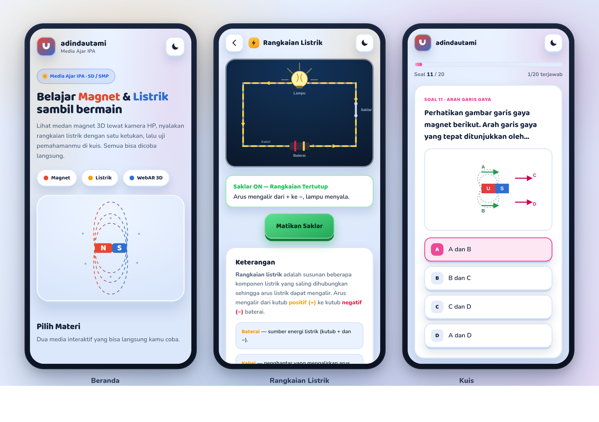
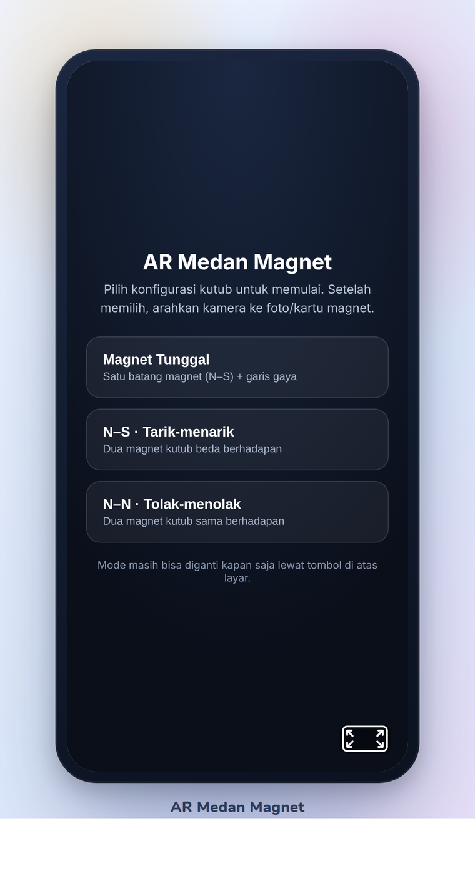
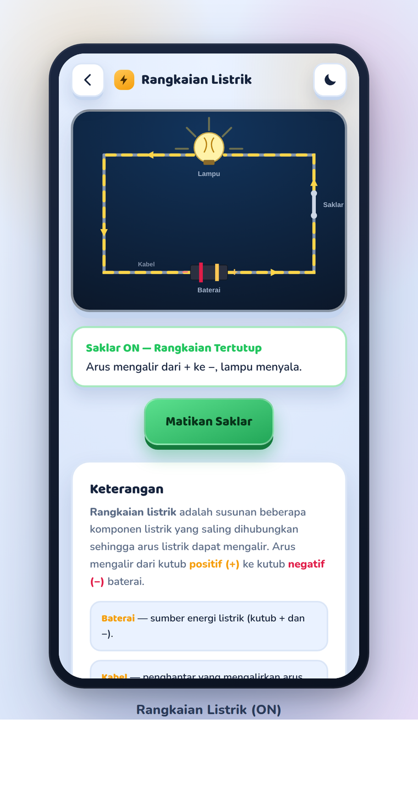
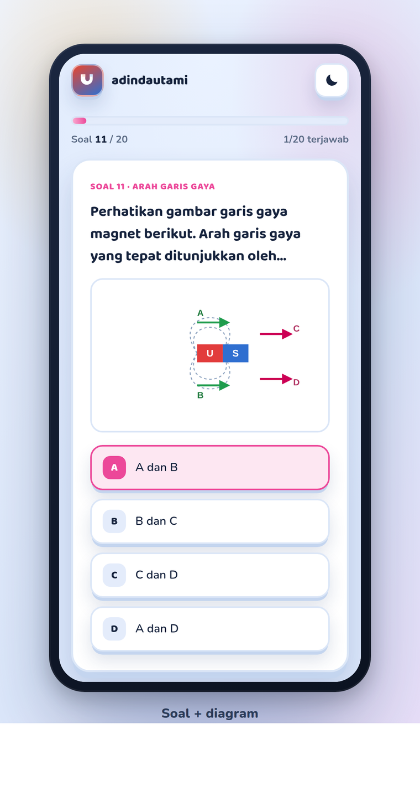
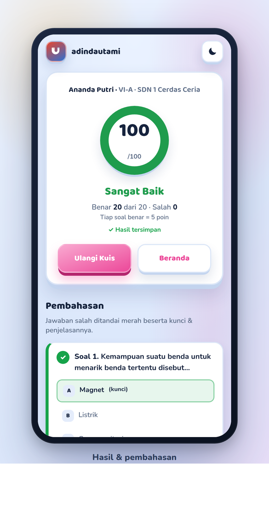
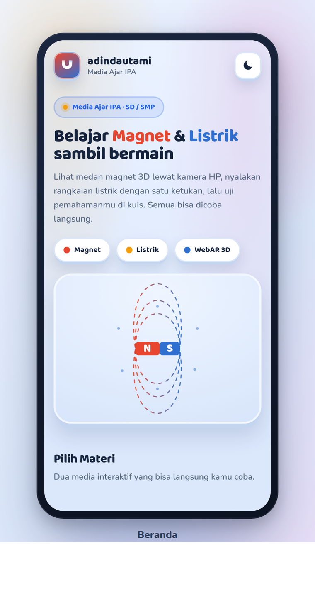
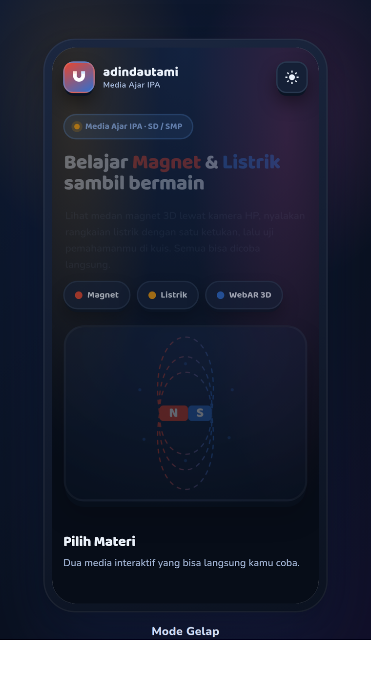

<div align="center">


# 🧲⚡ adindautami — Media Ajar IPA

### Magnet &amp; Listrik yang bisa **dilihat, disentuh, dan diuji** — langsung dari browser HP, tanpa instal aplikasi.

<p>
  <a href="https://utamiii.my.id/"><b>🌐 Buka Situs</b></a> &nbsp;·&nbsp;
  <a href="https://utamiii.my.id/magnet/"><b>🧲 AR Magnet</b></a> &nbsp;·&nbsp;
  <a href="https://utamiii.my.id/listrik/"><b>⚡ Rangkaian Listrik</b></a> &nbsp;·&nbsp;
  <a href="https://utamiii.my.id/kuis/"><b>📝 Kuis</b></a>
</p>

<p>
  <a href="https://utamiii.my.id/"></a>
  
  
  
</p>

<br>



<sub><i>Beranda · Rangkaian Listrik · Kuis — semua berjalan di browser HP.</i></sub>

</div>

---

## 📖 Daftar Isi

- [Tentang](#-tentang)
- [Fitur Utama](#-fitur-utama)
- [Modul](#-modul)
  - [🧲 Medan Magnet (AR)](#-medan-magnet-ar)
  - [⚡ Rangkaian Listrik](#-rangkaian-listrik)
  - [📝 Kuis Magnet &amp; Listrik](#-kuis-magnet--listrik)
- [Mode Terang &amp; Gelap](#-mode-terang--gelap)
- [Teknologi](#-teknologi)
- [Struktur Proyek](#-struktur-proyek)
- [Kuis &amp; Basis Data (Supabase)](#-kuis--basis-data-supabase)
- [Cara Pakai](#-cara-pakai)
- [Hosting &amp; Deploy](#-hosting--deploy)
- [Desain &amp; Aksesibilitas](#-desain--aksesibilitas)
- [Media 3D untuk Assemblr EDU](#-media-3d-untuk-assemblr-edu)
- [Lisensi](#-lisensi)

---

## 🎯 Tentang

**adindautami** adalah portal **media ajar IPA** untuk topik **Magnet** dan **Listrik**, dirancang khusus untuk siswa **SD/SMP**. Alih-alih hanya membaca teori, siswa bisa **berinteraksi langsung**:

- melihat **garis-gaya magnet 3D** melayang di atas kartu lewat kamera HP (Augmented Reality),
- **menyalakan rangkaian listrik** dan mengamati arus mengalir sampai lampu menyala,
- lalu **menguji pemahaman** lewat kuis 20 soal yang otomatis dinilai, lengkap dengan pembahasan.

Semuanya berjalan **100% di browser** — tanpa instal aplikasi, tanpa login untuk siswa. Cukup buka tautan.

> **Untuk siapa?** Guru IPA yang butuh media presentasi interaktif, dan siswa yang ingin belajar sambil bermain.

---

## ✨ Fitur Utama

| | |
|---|---|
| 🧲 **AR Medan Magnet** | Visualisasi garis gaya 3D lewat kamera HP, 3 konfigurasi kutub |
| ⚡ **Simulasi Rangkaian** | Saklar interaktif, arus beranimasi, rangkaian terbuka vs tertutup |
| 📝 **Kuis Otomatis** | 20 soal, skor real-time (maks 100), kunci &amp; pembahasan tiap soal |
| ☁️ **Rekap ke Cloud** | Hasil kuis tersimpan aman ke Supabase (dilindungi Row Level Security) |
| 🌗 **Mode Terang/Gelap** | Tema tersimpan otomatis, nyaman di segala kondisi cahaya |
| 📱 **Mobile-first** | Responsif mulus dari 320px, target sentuh besar, ramah HP |
| ♿ **Aksesibel** | Kontras terjaga, dukungan `prefers-reduced-motion`, label yang jelas |
| 🚀 **Tanpa instal** | Cukup browser HP; library AR di-*self-host* (tanpa CDN eksternal) |

---

## 🧩 Modul

### 🧲 Medan Magnet (AR)



Arahkan kamera HP ke **kartu magnet** yang tercetak, lalu magnet batang 3D beserta **garis-garis medannya** muncul melayang di atas kartu — dihitung dari fisika sungguhan (*field-line tracing* dari kutub).

**Tiga konfigurasi kutub** yang bisa diganti kapan saja:

- **Magnet Tunggal** — dipol batang, garis medan keluar dari **N** → masuk **S**
- **N–S · Tarik-menarik** — garis medan menyambung antar dua magnet
- **N–N · Tolak-menolak** — garis medan saling menjauh, tampak titik netral

> Dibangun dengan **A-Frame** + **MindAR** (image tracking) dan komponen garis-medan **Three.js**. Konvensi warna: **Utara = merah**, **Selatan = biru**.

<br clear="right">

### ⚡ Rangkaian Listrik



Simulasi **SVG interaktif** untuk memahami cara kerja rangkaian sederhana. Ketuk **saklar** (di gambar atau lewat tombol), lalu:

- **arus kuning beranimasi** mengalir mengelilingi rangkaian,
- **panah arah** menunjukkan aliran dari kutub **+** ke **−**,
- **lampu menyala** dengan pancaran cahaya.

Panel keterangan menjelaskan tiap komponen (baterai, kabel, saklar, lampu) dan membedakan **rangkaian tertutup** (arus mengalir) dari **rangkaian terbuka** (arus terputus).

> Murni SVG + CSS + JS — ringan, tanpa dependensi eksternal.

<br clear="right">

### 📝 Kuis Magnet &amp; Listrik

<table>
<tr>
<td width="50%"></td>
<td width="50%"></td>
</tr>
</table>

Kuis **20 soal pilihan ganda** seputar magnet &amp; listrik, tersusun sesuai taksonomi Bloom (C1–C6). Fitur:

- **Identitas siswa** (nama, kelas, sekolah) sebelum mulai.
- **Progress bar** &amp; navigasi soal; **wajib menjawab semua** sebelum mengumpulkan.
- **Diagram SVG** pada soal tertentu (garis gaya, kekuatan magnet, rangkaian).
- **Skor otomatis** — tiap benar = 5 poin, maksimal **100**, dengan predikat: *Sangat Baik / Baik / Cukup / Perlu Belajar Lagi*.
- **Pembahasan lengkap** tiap soal: jawaban benar ditandai hijau, jawaban salah merah, plus penjelasan.
- Hasil **otomatis tersimpan** ke basis data untuk direkap guru.

---

## 🌗 Mode Terang &amp; Gelap

Setiap halaman mendukung tema terang dan gelap; pilihan pengguna disimpan otomatis di perangkat.

<table>
<tr>
<td width="50%" align="center"><b>☀️ Terang</b><br></td>
<td width="50%" align="center"><b>🌙 Gelap</b><br></td>
</tr>
</table>

---

## 🛠 Teknologi

| Area | Teknologi |
|---|---|
| **AR / 3D** | [A-Frame 1.5](https://aframe.io) · [MindAR](https://github.com/hiukim/mind-ar-js) (image tracking) · [Three.js](https://threejs.org) |
| **UI** | HTML + CSS murni (gaya **Claymorphism**), font **Baloo 2** + **Nunito** |
| **Interaktivitas** | JavaScript (ES Modules), SVG beranimasi |
| **Basis data** | [Supabase](https://supabase.com) (PostgreSQL + REST + Row Level Security) |
| **Hosting** | [GitHub Pages](https://pages.github.com) di belakang [Cloudflare](https://cloudflare.com) (proxied, HTTPS otomatis) |

> Semua library AR **di-*self-host*** di `vendor/` — tidak bergantung pada CDN eksternal, jadi tetap jalan meski koneksi terbatas.

---

## 🗂 Struktur Proyek

```
/                          ← publishing root (GitHub Pages) · domain utamiii.my.id
├── index.html               🏠 beranda / hub (pilih materi)
├── magnet/index.html        🧲 AR medan magnet (A-Frame + MindAR)
├── listrik/index.html       ⚡ simulasi rangkaian listrik (SVG interaktif)
├── kuis/index.html          📝 kuis (memuat js/kuis.js)
├── js/
│   ├── kuis.js                logika kuis + simpan hasil ke Supabase
│   ├── soal.js                20 soal + diagram SVG (modul bersama)
│   └── config.js              konfigurasi Supabase (hanya anon key — aman)
├── field-lines.js           komponen garis medan (Three.js) — dipakai /magnet/
├── targets.mind             target image-tracking MindAR
├── vendor/                  A-Frame + MindAR (self-hosted, tanpa CDN)
├── assemblr/                📦 model 3D .glb untuk Assemblr EDU + preview
├── docs/preview/            🖼️ screenshot untuk README
├── CNAME · .nojekyll · 404.html   berkas wajib GitHub Pages
└── favicon* · og-image.jpg
```

---

## 🗄 Kuis &amp; Basis Data (Supabase)

Saat siswa menyelesaikan kuis, hasilnya dikirim ke tabel `hasil_kuis_utami`:

| Kolom | Tipe | Keterangan |
|---|---|---|
| `nama`, `kelas`, `sekolah` | `text` | Identitas siswa |
| `jawaban` | `jsonb` | Larik indeks jawaban tiap soal |
| `benar`, `salah`, `nilai` | `int` | Rekap penilaian (nilai 0–100) |
| `jumlah_soal`, `durasi_detik` | `int` | Total soal &amp; lama pengerjaan |
| `created_at` | `timestamptz` | Waktu pengumpulan (otomatis) |

**Keamanan — Row Level Security (RLS):**

- 🟢 Siswa (kunci **anon**, publik) **hanya boleh `INSERT`** — menyimpan hasilnya sendiri.
- 🔒 Siswa **tidak bisa membaca** data siswa lain; hanya akun **admin yang login** yang bisa `SELECT`.
- 🔑 Berkas `config.js` hanya memuat **anon key** yang memang publik; **service key tidak pernah ada di repo**.

> Pola ini memisahkan operasi tulis (siswa) dari baca (guru/admin) sambil menjaga privasi data siswa di lapisan basis data.

---

## 📱 Cara Pakai

<details open>
<summary><b>🧲 AR Medan Magnet</b></summary>

1. **Cetak marker** — gunakan `photo_2026-06-09_22-04-47.jpg` di repo ini; cetak / tempel di karton.
2. Buka **<https://utamiii.my.id/magnet/>** di browser HP (Chrome / Safari), izinkan akses **kamera**.
3. Pilih **konfigurasi kutub** di menu pembuka.
4. **Arahkan kamera** ke marker → magnet 3D + garis medan muncul melayang.
5. **Gerakkan HP** mengelilingi marker untuk melihat dari berbagai sudut.

</details>

<details>
<summary><b>📝 Kuis</b></summary>

1. Buka **<https://utamiii.my.id/kuis/>**.
2. Isi **nama, kelas, dan sekolah**.
3. Jawab **20 soal** (bisa maju-mundur; semua wajib terjawab).
4. Tekan **Kumpulkan** → lihat **skor**, predikat, dan **pembahasan** tiap soal.
5. Hasil otomatis tercatat untuk direkap guru.

</details>

> 📷 Kamera web membutuhkan **HTTPS** — sudah otomatis aktif (Cloudflare + GitHub Pages).

---

## ☁️ Hosting &amp; Deploy

Situs dilayani oleh **GitHub Pages** dan diproksi lewat **Cloudflare** untuk HTTPS instan pada domain `utamiii.my.id`.

```bash
# Perbarui situs
git add -A
git commit -m "pesan perubahan"
git push          # GitHub Pages rebuild otomatis (~1 menit)
```

- **Domain**: `utamiii.my.id` (apex → GitHub Pages, di-*proxy* Cloudflare, SSL *Full* + Always-HTTPS).
- Berkas `CNAME` menetapkan domain kustom; `.nojekyll` mematikan pemrosesan Jekyll.

---

## 🎨 Desain &amp; Aksesibilitas

Antarmuka memakai gaya **Claymorphism** — kartu tebal-membulat dengan bayangan lembut yang terasa "empuk" dan ramah anak. Prinsip yang dijaga:

- **Identitas visual bermakna** — warna kutub magnet (**N merah / S biru**) dipakai konsisten sebagai bahasa desain; tiap modul punya warna sendiri (magnet, listrik = amber, kuis = pink).
- **Tipografi berkarakter** — **Baloo 2** (judul) + **Nunito** (isi), bukan font default.
- **Responsif** — teruji tanpa *horizontal scroll* dari 320px hingga desktop.
- **Gerak yang menghormati preferensi** — animasi otomatis dinonaktifkan bila pengguna mengaktifkan `prefers-reduced-motion`.
- **Kontras &amp; sentuhan** — target sentuh besar (≥44px), kontras teks terjaga di kedua tema.

---

## 📦 Media 3D untuk Assemblr EDU

Model 3D siap-pakai (`.glb`, sudah beranimasi aliran medan) untuk di-**import ke Assemblr EDU** atau platform 3D lain:

| Model | Konsep | Unduh |
|---|---|---|
| 🧲 **Magnet Tunggal** | Dipol batang + garis medan 3D | [`magnet-tunggal.glb`](./assemblr/magnet-tunggal.glb) |
| 🧲🧲 **Tarik-menarik** | Dua magnet N–S berhadapan | [`magnet-tarik.glb`](./assemblr/magnet-tarik.glb) |
| 🧲🧲 **Tolak-menolak** | Dua magnet N–N berhadapan | [`magnet-tolak.glb`](./assemblr/magnet-tolak.glb) |

> **Di Assemblr EDU:** *Add Object → Import 3D Model* → pilih `.glb` → panel **Animation** → pilih klip `MedanMagnet` → aktifkan **loop/autoplay**.

---

## 📄 Lisensi

Dirilis di bawah lisensi **[MIT](./LICENSE)** © **Ksatria Bintang Samudra**.

<div align="center"><sub>Dibuat dengan ❤️ untuk pembelajaran IPA · <a href="https://utamiii.my.id">utamiii.my.id</a></sub></div>
