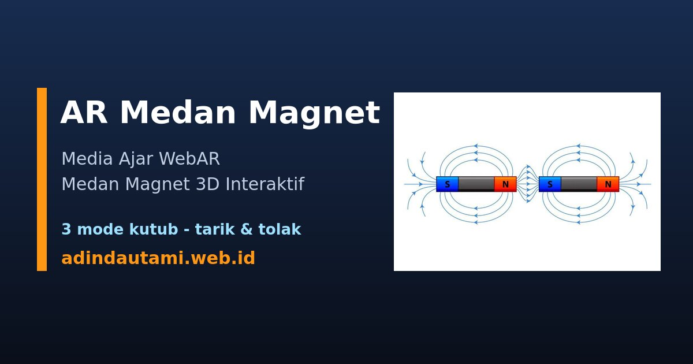

<p align="center">
  
</p>

<h1 align="center">🧲 AR Medan Magnet</h1>

<p align="center">
  <b>Media ajar berbasis Augmented Reality untuk memvisualisasikan medan magnet secara 3D — langsung dari browser HP, tanpa instal aplikasi.</b>
</p>

<p align="center">
  <a href="https://adindautami.web.id/"><b>🚀 Buka Demo Langsung</b></a>
</p>

<p align="center">
  
  
  
  
  
  
</p>

---

## 📑 Daftar Isi

- [Tentang](#tentang)
- [Fitur](#fitur)
- [Cara Pakai](#cara-pakai)
- [Gambar Penanda](#gambar-penanda)
- [Mode Konfigurasi Kutub](#mode-kutub)
- [Cara Kerja](#cara-kerja)
- [Teknologi](#teknologi)
- [Menjalankan Lokal](#menjalankan-lokal)
- [Struktur Proyek](#struktur-proyek)
- [Lisensi](#lisensi)

<a id="tentang"></a>
## 📖 Tentang

**AR Medan Magnet** adalah media ajar interaktif yang mengubah diagram magnet pada buku menjadi objek **3D yang hidup**. Cukup arahkan kamera HP ke gambar penanda, dan model magnet beserta **garis gaya magnet**-nya akan muncul melayang di atasnya — lengkap dengan partikel yang mengalir mengikuti arah medan.

Dibuat sebagai **media pembelajaran fisika** agar konsep medan magnet (aliran gaya antara kutub utara dan selatan, tarik-menarik, dan tolak-menolak) lebih mudah dipahami dan menarik bagi siswa.

<a id="fitur"></a>
## ✨ Fitur

- 📷 **WebAR Image Tracking** — berjalan di browser HP, tanpa instal aplikasi apa pun.
- 🧭 **3 mode konfigurasi kutub** dengan menu pembuka & tombol ganti cepat (tunggal / tarik / tolak).
- 🔬 **Garis medan berbasis fisika** — dihitung dengan *field-line tracing* dari model kutub, bukan gambar manual. Pola tarik/tolak muncul otomatis & benar secara fisika.
- ➡️ **Kepala panah & partikel mengalir** memperlihatkan arah medan **N → S** seperti diagram buku.
- 🧊 **Magnet 3D** mengkilap dengan label kutub, melayang & berputar di atas penanda.
- 🏷️ **Label callout** dinamis dengan garis penunjuk yang melacak objek saat berputar.
- 🎞️ **Transisi cross-fade** halus saat berganti mode (bukan pop).
- 👆 **Interaktif** — seret untuk memutar, gerakkan HP untuk melihat dari segala sisi.
- 🔗 **Pratinjau sosial (Open Graph)** rapi saat link dibagikan di WhatsApp/medsos.

<a id="cara-pakai"></a>
## 📱 Cara Pakai

1. Buka **[demo](https://adindautami.web.id/)** di browser HP.
2. Pada **menu pembuka**, pilih konfigurasi kutub (Magnet Tunggal / N–S Tarik / N–N Tolak).
3. **Izinkan akses kamera** saat diminta.
4. **Arahkan kamera ke gambar penanda** (cetak atau tampilkan di layar).
5. Model magnet 3D + medan magnet muncul melayang. Ganti mode kapan saja lewat tombol di atas.

> 💡 AR membutuhkan **HTTPS** (sudah terpenuhi) dan perangkat **berkamera** (HP / tablet).

<a id="gambar-penanda"></a>
## 🖼️ Gambar Penanda (Marker)

Arahkan kamera ke gambar ini — cetak atau tampilkan di layar:

<p align="center">
  
</p>

<a id="mode-kutub"></a>
## 🧭 Mode Konfigurasi Kutub

| Mode | Konfigurasi | Perilaku Garis Medan |
|:----:|-------------|----------------------|
| **A** | Bar magnet tunggal (N–S) | Garis gaya keluar dari kutub N, melengkung, masuk ke kutub S |
| **B** | Dua magnet **kutub beda** berhadapan (N–S) | Garis **menyambung & merapat** antar kutub → **tarik-menarik** |
| **C** | Dua magnet **kutub sama** berhadapan (N–N) | Garis **melengkung menjauh** dari celah → **tolak-menolak** |

<a id="cara-kerja"></a>
## 🔬 Cara Kerja

Setiap magnet dimodelkan sebagai dua **kutub titik**: utara (muatan **+**) dan selatan (muatan **−**). Medan di sembarang titik dihitung sebagai jumlah kontribusi seluruh kutub:

```
B(r) = Σ  qᵢ · (r − pᵢ) / |r − pᵢ|³
```

Lalu **garis gaya ditelusuri** (numerical field-line tracing, integrasi RK2) mengikuti arah medan dari kutub N hingga berakhir di kutub S. Karena perhitungan ini nyata, pola **tarik-menarik** dan **tolak-menolak** terbentuk dengan sendirinya — persis seperti pada diagram fisika.

Partikel dan kepala panah dianimasikan sepanjang tiap garis untuk menunjukkan arah aliran **N → S**.

<a id="teknologi"></a>
## 🛠️ Teknologi

| Komponen | Peran |
|---|---|
| [A-Frame](https://aframe.io) | Kerangka scene WebVR/AR deklaratif |
| [MindAR](https://github.com/hiukim/mind-ar-js) | Image tracking di browser |
| [Three.js](https://threejs.org) | Render 3D: kurva medan, partikel, panah, label |
| GitHub Pages | Hosting statis + HTTPS + custom domain |

Seluruh library di-*self-host* di folder `vendor/` — **tanpa proses build, tanpa ketergantungan CDN** (demo tetap jalan meski jaringan venue memblokir CDN).

<a id="menjalankan-lokal"></a>
## ▶️ Menjalankan Secara Lokal

```bash
# dari folder proyek
npx serve .
```

Buka di browser (`http://localhost:PORT`). Untuk menguji di HP, kamera butuh HTTPS — gunakan tunnel, misal:

```bash
cloudflared tunnel --url http://localhost:PORT
```

lalu buka URL `https://...` dari tunnel di HP.

<a id="struktur-proyek"></a>
## 📂 Struktur Proyek

```
.
├── index.html       # Halaman AR: scene, menu & tombol mode, pencahayaan, meta Open Graph
├── field-lines.js   # Komponen magnetic-field: fisika medan, partikel, panah, label, mode A/B/C
├── targets.mind     # Target image-tracking hasil kompilasi gambar penanda
├── vendor/          # Library self-hosted (A-Frame, MindAR)
├── photo_*.jpg      # Gambar penanda (marker)
├── og-image.jpg     # Gambar pratinjau saat link dibagikan
├── favicon.ico      # Ikon situs (+ apple-touch-icon.png)
├── 404.html         # Halaman 404 kustom
└── README.md
```

<a id="lisensi"></a>
## 📜 Lisensi

Dirilis di bawah [Lisensi MIT](./LICENSE) — bebas digunakan untuk keperluan edukasi.

---

<p align="center"><sub>© 2026 Ksatria Bintang Samudra</sub></p>
