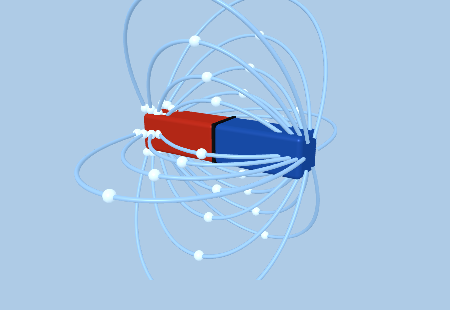
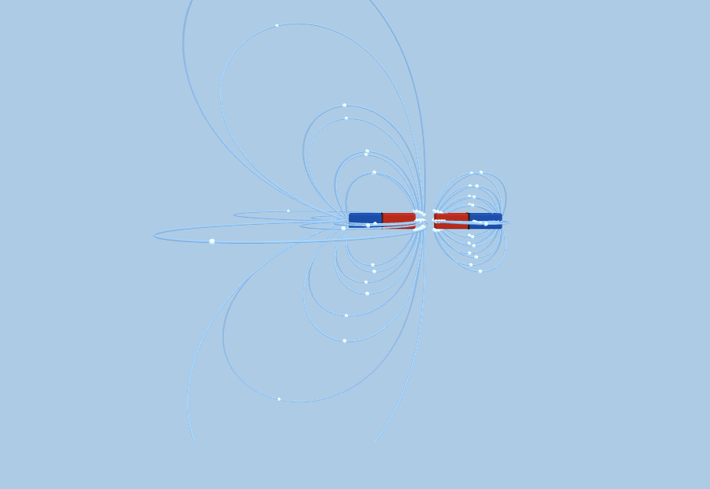

<h1 align="center">🧲 AR Medan Magnet</h1>

<p align="center">
  <b>Media ajar berbasis Augmented Reality — memvisualisasikan medan magnet dalam 3D,
  langsung dari browser HP tanpa instal aplikasi.</b>
</p>

<p align="center">
  <a href="https://adindautami.web.id/"><b>🚀 Buka Situs AR</b></a> &nbsp;·&nbsp;
  <a href="#-media-3d-untuk-assemblr-edu"><b>📦 Unduh Model 3D (.glb)</b></a>
</p>

<p align="center">
  
  
  
  
  
  <a href="https://adindautami.web.id/"></a>
</p>

<p align="center">
  
  <br><sub><i>Medan magnet batang divisualisasikan sebagai garis medan 3D — kutub Utara (merah) → Selatan (biru).</i></sub>
</p>

---

## 📑 Daftar Isi

- [Tentang](#tentang)
- [Visualisasi Medan Magnet](#-visualisasi-medan-magnet)
- [Media 3D untuk Assemblr EDU](#-media-3d-untuk-assemblr-edu)
- [Cara pakai (AR di HP)](#-cara-pakai-ar-di-hp)
- [Fisika singkat](#-fisika-singkat)
- [Struktur repo](#-struktur-repo)
- [Lisensi](#lisensi)

## Tentang

Media pembelajaran **Augmented Reality** untuk materi **Medan Magnet**. Pengguna memindai sebuah
**marker cetak**, lalu muncul magnet batang 3D beserta **garis-garis medan** yang dihitung dari fisika
sungguhan (*field-line tracing* dari kutub), langsung di atas kartu. Cocok untuk presentasi, praktikum,
dan tugas kuliah. Berjalan penuh di browser HP — **tanpa instal aplikasi**.

## 🧲 Visualisasi Medan Magnet

Tiga konfigurasi kutub yang bisa diganti saat AR berjalan — garis medan dihitung otomatis dari
tanda kutub, jadi efek **tarik** & **tolak** muncul apa adanya sesuai fisika:

<table>
<tr>
  <td width="33%" align="center"></td>
  <td width="33%" align="center"></td>
  <td width="33%" align="center"></td>
</tr>
<tr>
  <td align="center"><b>Magnet Tunggal</b><br><sub>dipol batang — garis N → S</sub></td>
  <td align="center"><b>Tarik-menarik (N–S)</b><br><sub>garis menyambung antar magnet</sub></td>
  <td align="center"><b>Tolak-menolak (N–N)</b><br><sub>garis memancar menjauhi celah</sub></td>
</tr>
</table>

**Konvensi warna:** kutub **Utara = merah**, **Selatan = biru**. Garis medan selalu keluar dari **N**
dan masuk ke **S**; butiran mengalir menunjukkan arah medan.

## 📦 Media 3D untuk Assemblr EDU

Model 3D siap-pakai (`.glb`, sudah beranimasi aliran medan) untuk di-**import ke Assemblr EDU** atau
platform AR/3D lain. Tinggal unduh dan upload:

| Model | Konsep | Unduh |
|---|---|---|
| 🧲 **Magnet Tunggal** | Dipol batang + garis medan 3D | [`magnet-tunggal.glb`](./assemblr/magnet-tunggal.glb) |
| 🧲🧲 **Tarik-menarik** | Dua magnet N–S berhadapan | [`magnet-tarik.glb`](./assemblr/magnet-tarik.glb) |
| 🧲🧲 **Tolak-menolak** | Dua magnet N–N berhadapan | [`magnet-tolak.glb`](./assemblr/magnet-tolak.glb) |

> **Cara di Assemblr EDU:** *Add Object → Import 3D Model* → pilih file `.glb` → pada panel **Animation**
> pilih klip `MedanMagnet` → aktifkan **loop/autoplay**. Model tampil tegak (Y-up) dan siap diskalakan.

## 📱 Cara pakai (AR di HP)

1. **Cetak marker** — gunakan `photo_2026-06-09_22-04-47.jpg` di repo ini; cetak / tempel di karton.
2. Buka [**situs AR**](https://adindautami.web.id/) di **browser HP** (Chrome/Safari), izinkan kamera.
3. Pilih konfigurasi kutub di menu pembuka → arahkan kamera ke marker → magnet 3D + garis medan muncul.
4. Gerakkan HP mengelilingi marker untuk melihat dari berbagai sudut.

> Kamera web butuh **HTTPS** — otomatis aktif di GitHub Pages. Detail teknis di [`PANDUAN.md`](./PANDUAN.md).

## 🔬 Fisika singkat

Garis medan magnet **selalu membentuk lintasan tertutup**: keluar dari kutub **Utara (N)**, melengkung
di luar magnet, lalu masuk ke kutub **Selatan (S)**, dan menyambung di dalam magnet.

- **Kutub sejenis** (N–N atau S–S) → **tolak-menolak**; garis medan saling menjauh, ada titik netral.
- **Kutub tak sejenis** (N–S) → **tarik-menarik**; garis medan menyambung dari satu magnet ke magnet lain.
- Kerapatan garis ∝ **kuat medan** — makin rapat garis, makin kuat medannya (dekat kutub).

## 🗂️ Struktur repo

```
/                     ← publishing root GitHub Pages (situs = medan magnet)
├── index.html          scene A-Frame + MindAR (menu pilih mode + AR)
├── field-lines.js      komponen garis medan (field-line tracing, Three.js)
├── targets.mind        target image-tracking
├── photo_2026-06-09_22-04-47.jpg   contoh marker untuk dicetak
├── CNAME .nojekyll 404.html        wajib di root (GitHub Pages)
├── favicon*, og-image.jpg
├── PANDUAN.md          dokumentasi teknis
├── vendor/             A-Frame + MindAR (self-hosted)
└── assemblr/           📦 model 3D .glb untuk Assemblr EDU + preview
```

Update situs: `git add -A && git commit -m "..." && git push` → GitHub Pages rebuild otomatis (~1 menit).

## Lisensi

[MIT](./LICENSE) © **Ksatria Bintang Samudra**
