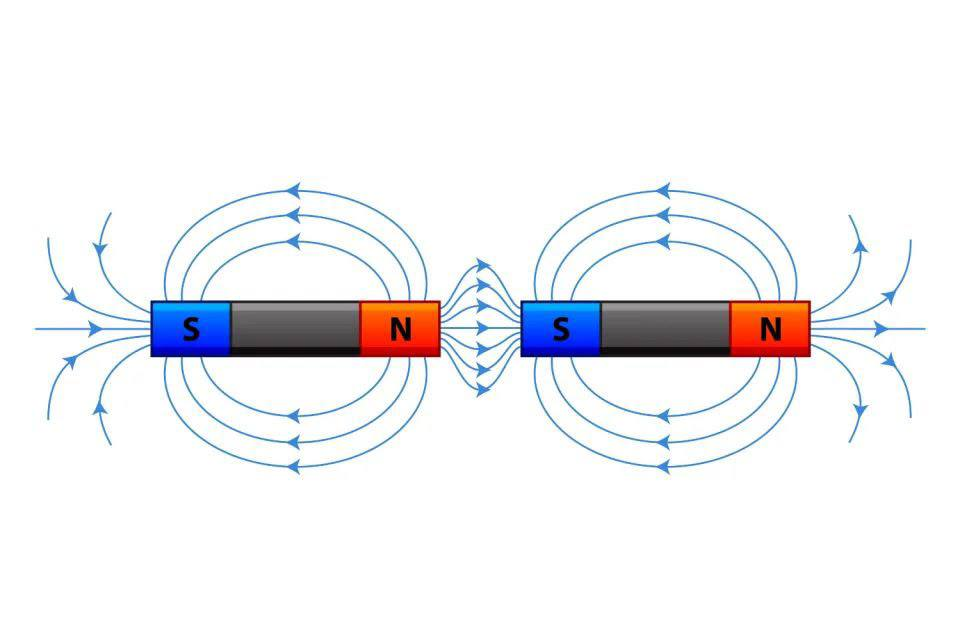

# 🧲 AR Medan Magnet — WebAR Edukasi

Media ajar **Augmented Reality** interaktif untuk memvisualisasikan **medan magnet** secara 3D, langsung dari browser HP tanpa perlu instal aplikasi. Cukup arahkan kamera ke gambar penanda, dan model magnet 3D beserta garis gaya magnetnya akan muncul melayang di atasnya.

<p align="center">
  <a href="https://adindautami.web.id/"><b>🚀 Buka Demo Langsung</b></a>
</p>

<p align="center">
  
  
  
  
  
</p>

---

## ✨ Fitur

- 📷 **Image tracking WebAR** — jalan di browser HP, tanpa instal aplikasi.
- 🧭 **3 mode konfigurasi kutub** dengan menu pembuka & tombol ganti cepat:
  - **A — Magnet Tunggal** (N–S): garis gaya keluar dari N, masuk ke S.
  - **B — N–S Berhadapan** (kutub beda): garis menyambung & merapat → **tarik-menarik**.
  - **C — N–N Berhadapan** (kutub sama): garis melengkung menjauh → **tolak-menolak**.
- 🔬 **Garis medan berbasis fisika** — dihitung dengan *field-line tracing* dari model kutub, bukan gambar manual. Efek tarik/tolak muncul otomatis & benar secara fisika.
- ➡️ **Kepala panah & partikel mengalir** menunjukkan arah medan **N → S**.
- 🧊 **Magnet 3D** mengkilap dengan label kutub, melayang & berputar di atas penanda.
- 🏷️ **Label callout** (Kutub Utara, Kutub Selatan, dll) dengan garis penunjuk yang melacak objek.
- 🎞️ **Transisi cross-fade** halus saat berganti mode (bukan pop).
- 👆 **Interaktif** — seret jari untuk memutar, gerakkan HP untuk melihat dari segala sisi.

## 📱 Cara Pakai

1. Buka **link demo** di browser HP.
2. Pada **menu pembuka**, pilih konfigurasi kutub (A / B / C).
3. **Izinkan akses kamera** saat diminta.
4. **Arahkan kamera ke gambar penanda** (lihat di bawah) — cetak atau tampilkan di layar.
5. Model magnet 3D + medan magnet akan muncul melayang. Ganti mode kapan saja lewat tombol di atas.

> 💡 Kamera AR butuh **HTTPS** (sudah terpenuhi via GitHub Pages) dan perangkat **berkamera** (HP / tablet).

## 🖼️ Gambar Penanda (Marker)

Arahkan kamera ke gambar ini (cetak atau tampilkan di layar):

<p align="center">
  
</p>

## 🛠️ Teknologi

| Komponen | Peran |
|---|---|
| [A-Frame](https://aframe.io) | Kerangka scene WebVR/AR deklaratif |
| [MindAR](https://github.com/hiukim/mind-ar-js) | Image tracking di browser |
| [Three.js](https://threejs.org) | Render 3D, kurva medan, partikel, kepala panah |
| GitHub Pages | Hosting statis + HTTPS |

Semua library dimuat via CDN — **tanpa proses build**.

## ▶️ Menjalankan Secara Lokal

```bash
# dari folder proyek
npx serve .
```

Buka di browser (`http://localhost:PORT`). Untuk uji di HP, perlu HTTPS — gunakan tunnel, mis.:

```bash
cloudflared tunnel --url http://localhost:PORT
```

lalu buka URL `https://...` dari tunnel di HP.

## 📂 Struktur Proyek

```
.
├── index.html       # Halaman AR: scene, UI menu & tombol mode, pencahayaan
├── field-lines.js   # Komponen magnetic-field: fisika medan, partikel, panah, label, mode A/B/C
├── targets.mind     # Target image-tracking hasil kompilasi gambar penanda
├── photo_*.jpg      # Gambar penanda (marker)
└── README.md
```

## 🔬 Catatan Fisika

Setiap magnet dimodelkan sebagai dua **kutub titik** (N = +, S = −). Medan di suatu titik dihitung sebagai jumlah kontribusi semua kutub, lalu **garis gaya ditelusuri** mengikuti arah medan dari kutub N hingga masuk ke kutub S. Karena perhitungan ini nyata, pola **tarik-menarik** (kutub beda) dan **tolak-menolak** (kutub sama) muncul dengan sendirinya — sesuai diagram pada buku fisika.

## 📖 Latar Belakang

Proyek ini dibuat sebagai **media ajar sederhana berbasis Augmented Reality**: memvisualisasikan magnet dua kutub beserta aliran gaya magnet antara kutub utara dan selatan, agar konsep medan magnet lebih mudah dipahami dan menarik.

## 📜 Lisensi

Dirilis di bawah [Lisensi MIT](./LICENSE). Bebas digunakan untuk keperluan edukasi.
