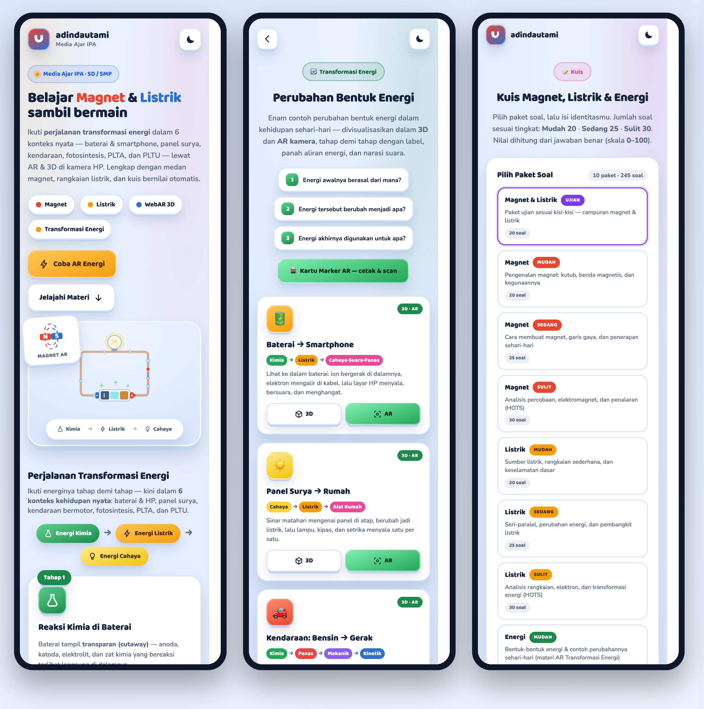
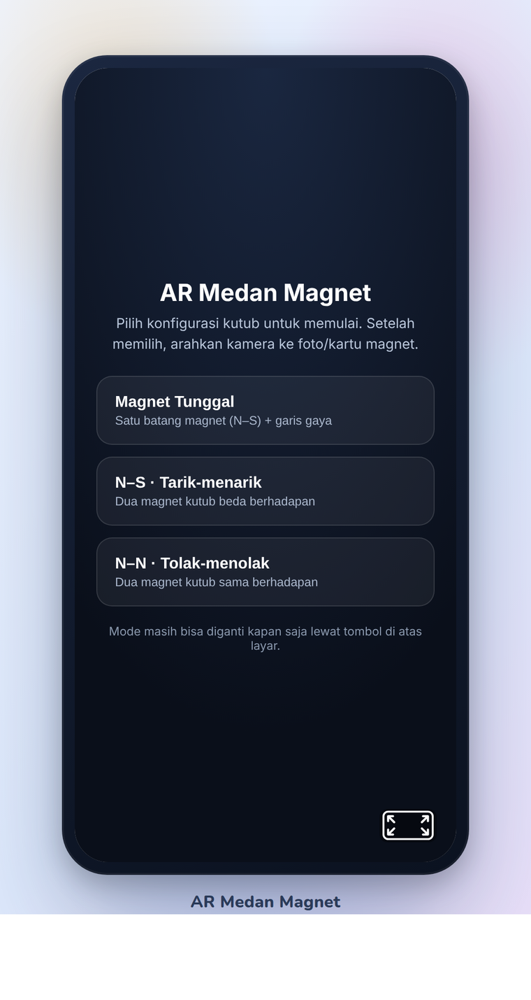
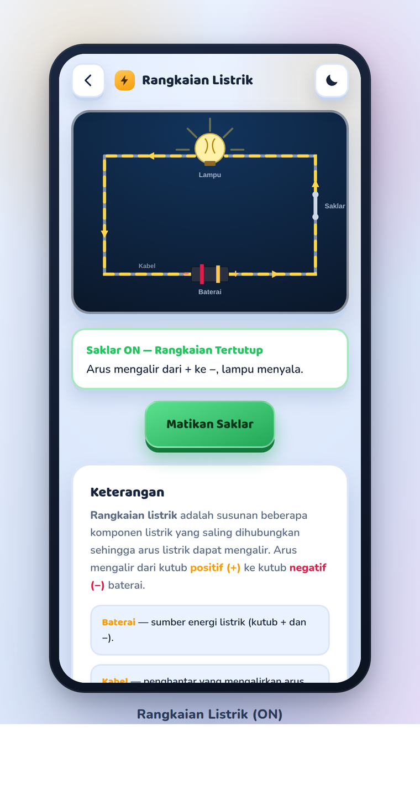
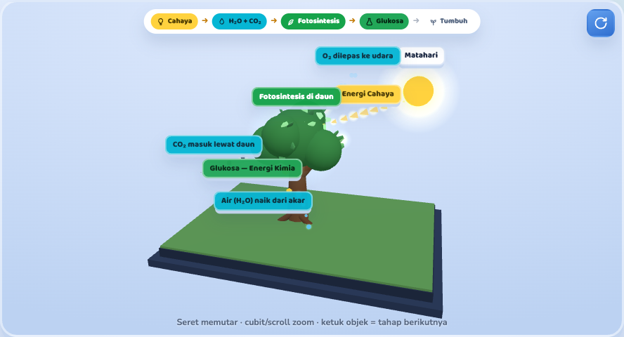
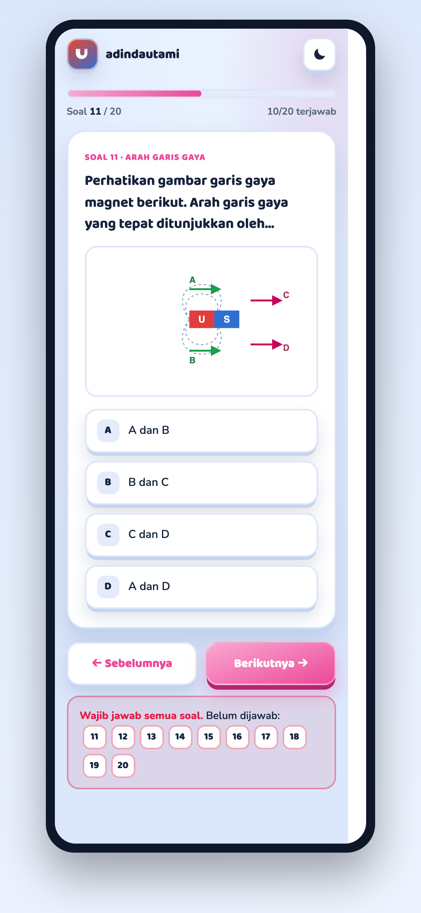
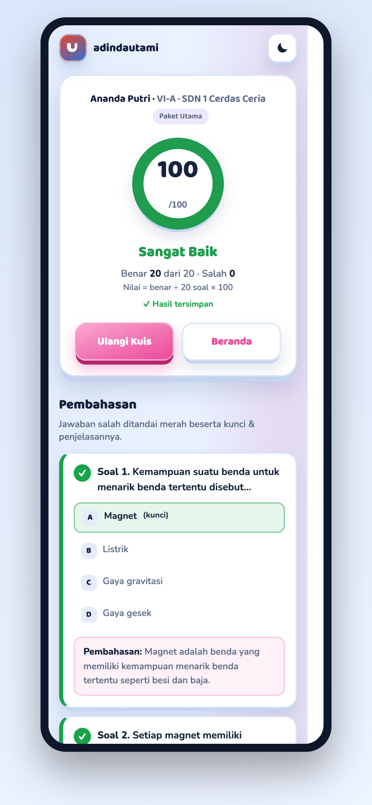
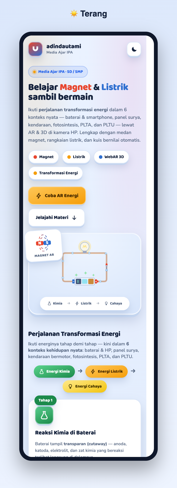
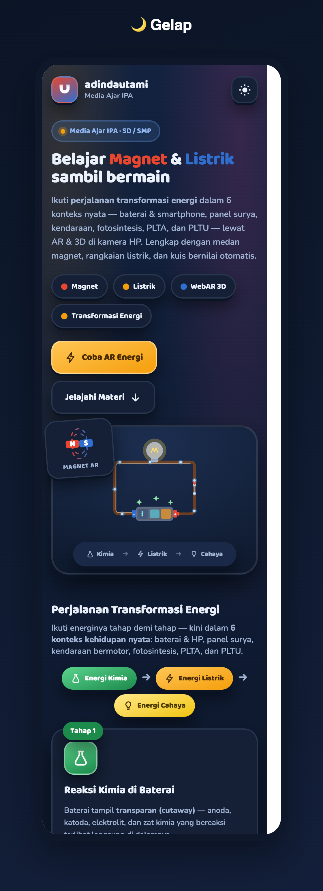

<div align="center">


# 🧲⚡ adindautami — Media Ajar IPA

### Magnet, Listrik &amp; Transformasi Energi yang bisa **dilihat, disentuh, dan diuji** — langsung dari browser HP, tanpa instal aplikasi.

<p>
  <a href="https://utamiii.my.id/"><b>🌐 Buka Situs</b></a> &nbsp;·&nbsp;
  <a href="https://utamiii.my.id/magnet/"><b>🧲 AR Magnet</b></a> &nbsp;·&nbsp;
  <a href="https://utamiii.my.id/listrik/"><b>⚡ Rangkaian Listrik</b></a> &nbsp;·&nbsp;
  <a href="https://utamiii.my.id/energi/"><b>🔄 Transformasi Energi</b></a> &nbsp;·&nbsp;
  <a href="https://utamiii.my.id/kuis/"><b>📝 Kuis</b></a>
</p>

<p>
  <a href="https://utamiii.my.id/"></a>
  
  
  
</p>

<br>



<sub><i>Beranda · Transformasi Energi · Kuis — semua berjalan di browser HP.</i></sub>

</div>

---

## 📖 Daftar Isi

- [Tentang](#-tentang)
- [Fitur Utama](#-fitur-utama)
- [Modul](#-modul)
  - [🧲 Medan Magnet (AR)](#-medan-magnet-ar)
  - [⚡ Rangkaian Listrik](#-rangkaian-listrik)
  - [🔄 Transformasi Energi — 6 Konteks](#-transformasi-energi--6-konteks)
  - [📝 Kuis Magnet &amp; Listrik](#-kuis-magnet--listrik)
- [Mode Terang &amp; Gelap](#-mode-terang--gelap)
- [Teknologi](#-teknologi)
- [Struktur Proyek](#-struktur-proyek)
- [Kuis &amp; Basis Data (Supabase)](#-kuis--basis-data-supabase)
- [Cara Pakai](#-cara-pakai)
- [Hosting &amp; Deploy](#-hosting--deploy)
- [Desain &amp; Aksesibilitas](#-desain--aksesibilitas)
- [Media 3D untuk Assemblr EDU](#-media-3d-untuk-assemblr-edu)
- [Lisensi](#-lisensi)

---

## 🎯 Tentang

**adindautami** adalah portal **media ajar IPA** untuk topik **Magnet**, **Listrik**, dan **Transformasi Energi**, dirancang khusus untuk siswa **SD/SMP**. Alih-alih hanya membaca teori, siswa bisa **berinteraksi langsung**:

- melihat **garis-gaya magnet 3D** melayang di atas kartu lewat kamera HP (Augmented Reality),
- **menyalakan rangkaian listrik** dan mengamati arus mengalir sampai lampu menyala,
- mengikuti **perjalanan transformasi energi** dalam 6 konteks nyata (baterai &amp; HP, panel surya, kendaraan, fotosintesis, PLTA, PLTU) — dalam 3D dan AR dengan **kartu marker cetak**,
- lalu **menguji pemahaman** lewat kuis **10 paket · 245 soal** yang otomatis dinilai, lengkap dengan pembahasan.

Semuanya berjalan **100% di browser** — tanpa instal aplikasi, tanpa login untuk siswa. Cukup buka tautan.

> **Untuk siapa?** Guru IPA yang butuh media presentasi interaktif, dan siswa yang ingin belajar sambil bermain.

---

## ✨ Fitur Utama

| | |
|---|---|
| 🧲 **AR Medan Magnet** | Visualisasi garis gaya 3D lewat kamera HP, 3 konfigurasi kutub |
| ⚡ **Simulasi Rangkaian** | Saklar interaktif, arus beranimasi, rangkaian terbuka vs tertutup |
| 🔄 **Transformasi Energi** | 6 konteks perubahan energi dalam 3D &amp; AR — markerless maupun **kartu marker cetak** |
| 📝 **Kuis Otomatis** | 10 paket · 245 soal, nilai 0–100 adaptif, kunci &amp; pembahasan tiap soal |
| ☁️ **Rekap ke Cloud** | Hasil kuis tersimpan aman ke Supabase (dilindungi Row Level Security) |
| 🌗 **Mode Terang/Gelap** | Tema tersimpan otomatis, nyaman di segala kondisi cahaya |
| 📱 **Mobile-first** | Responsif mulus dari 320px, target sentuh besar, ramah HP |
| ♿ **Aksesibel** | Kontras terjaga, dukungan `prefers-reduced-motion`, label yang jelas |
| 🚀 **Tanpa instal** | Cukup browser HP; library AR di-*self-host* (tanpa CDN eksternal) |

---

## 🧩 Modul

### 🧲 Medan Magnet (AR)



Arahkan kamera HP ke **kartu magnet** yang tercetak, lalu magnet batang 3D beserta **garis-garis medannya** muncul melayang di atas kartu — dihitung dari fisika sungguhan (*field-line tracing* dari kutub).

**Tiga konfigurasi kutub** yang bisa diganti kapan saja:

- **Magnet Tunggal** — dipol batang, garis medan keluar dari **N** → masuk **S**
- **N–S · Tarik-menarik** — garis medan menyambung antar dua magnet
- **N–N · Tolak-menolak** — garis medan saling menjauh, tampak titik netral

> Dibangun dengan **A-Frame** + **MindAR** (image tracking) dan komponen garis-medan **Three.js**. Konvensi warna: **Utara = merah**, **Selatan = biru**.

<br clear="right">

### ⚡ Rangkaian Listrik



Satu materi, tiga cara belajar — dari halaman `/listrik/` siswa memilih mode:

- **Simulasi 2D** — diagram SVG interaktif: ketuk **saklar**, **arus kuning beranimasi** mengalir, **panah arah** menunjukkan aliran dari kutub **+** ke **−**, dan **lampu menyala**.
- **Lihat 3D** — rangkaian tiga dimensi (Three.js) yang bisa **diputar bebas**, dengan label menempel di tiap komponen, arus partikel, dan lampu menyala saat saklar ditutup.
- **AR Kamera** — **perjalanan transformasi energi** interaktif dalam 3 tahap: ① *Energi Kimia* — baterai tampil **cutaway** (anoda −, katoda +, elektrolit, zat kimia yang bereaksi), ② *Aliran Listrik* — **elektron** (bola bercahaya) bergerak **di dalam kabel semi-transparan** dari kutub − ke +, dan **lampu baru mulai menyala saat elektron tiba**, ③ *Transformasi Energi* — lampu terang penuh: **Energi Kimia → Energi Listrik → Energi Cahaya**. Setiap tahap punya narasi teks + **narasi suara** (Web Speech, bisa dibisukan). Dua mode kamera: **Tanpa Marker** (melayang — seret memutar, cubit zoom) atau **Marker** — pindai **[Kartu Listrik](https://utamiii.my.id/listrik/ar/kartu/)** yang dicetak, dan rangkaian muncul menempel di atas kartu (image-tracking MindAR).

> Fokus AR: *“Visualisasi transformasi energi kimia menjadi energi listrik dan energi listrik menjadi energi cahaya melalui simulasi interaktif baterai dan rangkaian lampu.”*

Panel keterangan menjelaskan tiap komponen (baterai, kabel, saklar, lampu) dan membedakan **rangkaian tertutup** (arus mengalir) dari **rangkaian terbuka** (arus terputus).

> Semua dependensi (Three.js, MindAR) di-vendor lokal — tanpa CDN.

<br clear="right">

### 🔄 Transformasi Energi — 6 Konteks



**Enam contoh perubahan bentuk energi** dalam kehidupan sehari-hari, masing-masing tersedia sebagai **penampil 3D** (`/energi/3d/`) dan **AR kamera** (`/energi/ar/`) dalam dua mode — **Tanpa Marker** (model melayang) dan **Marker**: pindai salah satu dari **[6 kartu marker siap cetak](https://utamiii.my.id/energi/ar/kartu/)**, dan adegan 3D muncul **menempel di atas kartu** (image-tracking MindAR; QR pada tiap kartu langsung membuka mode marker materi tersebut):

| Konteks | Urutan perubahan energi |
|---|---|
| 🔋 **Baterai → Smartphone** | Kimia → Listrik → Cahaya + Suara + Panas |
| ☀️ **Panel Surya → Rumah** | Cahaya → Listrik → Cahaya (lampu) · Gerak (kipas) · Panas (setrika) |
| 🚗 **Kendaraan Bermotor** | Kimia (bensin) → Panas (pembakaran) → Mekanik (piston) → Kinetik |
| 🌱 **Fotosintesis** | Cahaya + H₂O + CO₂ → Glukosa (Kimia) + O₂ → Pertumbuhan |
| 💧 **PLTA** | Potensial (waduk) → Kinetik (air) → Mekanik (turbin) → Listrik |
| 🏭 **PLTU** | Kimia (batu bara) → Panas → Uap (kinetik) → Mekanik → Listrik |

Setiap adegan mengikuti **template seragam** dan menjawab tiga pertanyaan kunci — *energi dari mana? berubah jadi apa? dipakai untuk apa?* — lewat:

- **Objek utama 3D** prosedural (Three.js) di atas papan claymorphism, bisa diputar bebas / dilihat lewat kamera — sampai detail kecil seperti **helai-helai daun yang berkilau "menyerap" sinar matahari** pada adegan fotosintesis.
- **Tahap interaktif** (3–5 tahap per konteks) — ketuk layar atau tombol tahap untuk mengikuti energi selangkah demi selangkah; **rantai energi** di atas menyala mengikuti tahap.
- **Label menempel berwarna per bentuk energi** (kimia hijau, listrik amber, panas merah, mekanik ungu, kinetik biru, dst.) yang berganti sesuai tahap.
- **Panah & partikel aliran** — elektron, foton, air, uap, bahan bakar — bergerak menyusuri jalurnya; efek **sebab-akibat** dijaga (mis. lampu rumah baru menyala setelah arus *tiba*).
- **Narasi teks + suara** (Web Speech id-ID) per tahap.

Ketepatan konsep dijaga sesuai kaidah IPA: **ion bergerak di dalam baterai, elektron di rangkaian luar** (bukan "ion mengalir ke HP"); kendaraan memakai urutan **kimia → panas → mekanik → kinetik** (bukan "kinetik → gerak"); dan pada fotosintesis **matahari tidak "memasak" buah** — buah tumbuh dari energi kimia hasil fotosintesis.

### 📝 Kuis Magnet &amp; Listrik

<table>
<tr>
<td width="50%"></td>
<td width="50%"></td>
</tr>
</table>

Kuis pilihan ganda **10 paket · 245 soal** — siswa memilih paket sesuai topik &amp; tingkatnya (paket AR Transformasi Energi berdiri sendiri, tidak dicampur ke paket lain):

| Paket | Mudah | Sedang | Sulit |
|---|---|---|---|
| **Paket Utama** (kisi-kisi ujian, campuran) | — | 20 soal | — |
| **Magnet** | 20 | 25 | 30 |
| **Listrik** | 20 | 25 | 30 |
| **Energi** *(materi AR Transformasi Energi)* | 20 | 25 | 30 |

Fitur:

- **Identitas siswa** (nama, kelas, sekolah) sebelum mulai; pemilih paket dengan deep-link `?paket=`.
- **Progress bar** &amp; navigasi soal; **wajib menjawab semua** sebelum mengumpulkan.
- **Diagram SVG** pada soal tertentu (garis gaya, kekuatan magnet, rangkaian).
- **Nilai 0–100 adaptif** — benar ÷ jumlah soal × 100, berapa pun ukuran paketnya; soal *Sulit* = HOTS level SD.
- **Pembahasan lengkap** tiap soal: jawaban benar ditandai hijau, jawaban salah merah, plus penjelasan.
- Hasil **otomatis tersimpan** ke basis data (beserta nama paketnya) untuk direkap guru.

---

## 🌗 Mode Terang &amp; Gelap

Setiap halaman mendukung tema terang dan gelap; pilihan pengguna disimpan otomatis di perangkat.

<table>
<tr>
<td width="50%" align="center"><b>☀️ Terang</b><br></td>
<td width="50%" align="center"><b>🌙 Gelap</b><br></td>
</tr>
</table>

---

## 🛠 Teknologi

| Area | Teknologi |
|---|---|
| **AR / 3D** | [A-Frame 1.5](https://aframe.io) · [MindAR](https://github.com/hiukim/mind-ar-js) (image tracking) · [Three.js](https://threejs.org) |
| **UI** | HTML + CSS murni (gaya **Claymorphism**), font **Baloo 2** + **Nunito** |
| **Interaktivitas** | JavaScript (ES Modules), SVG beranimasi |
| **Basis data** | [Supabase](https://supabase.com) (PostgreSQL + REST + Row Level Security) |
| **Hosting** | [GitHub Pages](https://pages.github.com) di belakang [Cloudflare](https://cloudflare.com) (proxied, HTTPS otomatis) |

> Semua library AR **di-*self-host*** di `vendor/` — tidak bergantung pada CDN eksternal, jadi tetap jalan meski koneksi terbatas.

---

## 🗂 Struktur Proyek

```
/                          ← publishing root (GitHub Pages) · domain utamiii.my.id
├── index.html               🏠 beranda / hub (pilih materi)
├── magnet/index.html        🧲 AR medan magnet (A-Frame + MindAR)
├── listrik/index.html       ⚡ simulasi rangkaian listrik (SVG interaktif)
├── energi/                  🔄 transformasi energi — 6 konteks
│   ├── index.html             menu pilih konteks
│   ├── 3d/index.html          penampil 3D (?m=slug)
│   └── ar/                    AR kamera (?m=slug · &mode=marker)
│       ├── index.html           dua mode: markerless & marker (MindAR)
│       ├── kartu/index.html     halaman cetak 6 kartu marker
│       └── kartu-*.png · *.mind  kartu marker + target image-tracking
├── kuis/index.html          📝 kuis (memuat js/kuis.js)
├── js/
│   ├── kuis.js                logika kuis + simpan hasil ke Supabase
│   ├── soal.js                20 soal + diagram SVG (modul bersama)
│   ├── config.js              konfigurasi Supabase (hanya anon key — aman)
│   ├── energi3d.js · energiAR.js   driver halaman 3D & AR transformasi energi
│   └── energi/                mesin adegan: core.js + registry.js + ui.js + 6 adegan
│       (baterai · surya · motor · fotosintesis · plta · pltu)
├── field-lines.js           komponen garis medan (Three.js) — dipakai /magnet/
├── targets.mind             target image-tracking MindAR
├── vendor/                  A-Frame + MindAR (self-hosted, tanpa CDN)
├── assemblr/                📦 model 3D .glb untuk Assemblr EDU + preview
├── docs/preview/            🖼️ screenshot untuk README
├── CNAME · .nojekyll · 404.html   berkas wajib GitHub Pages
└── favicon* · og-image.jpg
```

---

## 🗄 Kuis &amp; Basis Data (Supabase)

Saat siswa menyelesaikan kuis, hasilnya dikirim ke tabel `hasil_kuis_utami`:

| Kolom | Tipe | Keterangan |
|---|---|---|
| `nama`, `kelas`, `sekolah` | `text` | Identitas siswa |
| `jawaban` | `jsonb` | Larik indeks jawaban tiap soal |
| `benar`, `salah`, `nilai` | `int` | Rekap penilaian (nilai 0–100) |
| `jumlah_soal`, `durasi_detik` | `int` | Total soal &amp; lama pengerjaan |
| `created_at` | `timestamptz` | Waktu pengumpulan (otomatis) |

**Keamanan — Row Level Security (RLS):**

- 🟢 Siswa (kunci **anon**, publik) **hanya boleh `INSERT`** — menyimpan hasilnya sendiri.
- 🔒 Siswa **tidak bisa membaca** data siswa lain; hanya akun **admin yang login** yang bisa `SELECT`.
- 🔑 Berkas `config.js` hanya memuat **anon key** yang memang publik; **service key tidak pernah ada di repo**.

> Pola ini memisahkan operasi tulis (siswa) dari baca (guru/admin) sambil menjaga privasi data siswa di lapisan basis data.

---

## 📱 Cara Pakai

<details open>
<summary><b>🧲 AR Medan Magnet</b></summary>

1. **Cetak marker** — gunakan `photo_2026-06-09_22-04-47.jpg` di repo ini; cetak / tempel di karton.
2. Buka **<https://utamiii.my.id/magnet/>** di browser HP (Chrome / Safari), izinkan akses **kamera**.
3. Pilih **konfigurasi kutub** di menu pembuka.
4. **Arahkan kamera** ke marker → magnet 3D + garis medan muncul melayang.
5. **Gerakkan HP** mengelilingi marker untuk melihat dari berbagai sudut.

</details>

<details>
<summary><b>📝 Kuis</b></summary>

1. Buka **<https://utamiii.my.id/kuis/>**.
2. Isi **nama, kelas, dan sekolah**.
3. Jawab **20 soal** (bisa maju-mundur; semua wajib terjawab).
4. Tekan **Kumpulkan** → lihat **skor**, predikat, dan **pembahasan** tiap soal.
5. Hasil otomatis tercatat untuk direkap guru.

</details>

> 📷 Kamera web membutuhkan **HTTPS** — sudah otomatis aktif (Cloudflare + GitHub Pages).

---

## ☁️ Hosting &amp; Deploy

Situs dilayani oleh **GitHub Pages** dan diproksi lewat **Cloudflare** untuk HTTPS instan pada domain `utamiii.my.id`.

```bash
# Perbarui situs
git add -A
git commit -m "pesan perubahan"
git push          # GitHub Pages rebuild otomatis (~1 menit)
```

- **Domain**: `utamiii.my.id` (apex → GitHub Pages, di-*proxy* Cloudflare, SSL *Full* + Always-HTTPS).
- Berkas `CNAME` menetapkan domain kustom; `.nojekyll` mematikan pemrosesan Jekyll.

---

## 🎨 Desain &amp; Aksesibilitas

Antarmuka memakai gaya **Claymorphism** — kartu tebal-membulat dengan bayangan lembut yang terasa "empuk" dan ramah anak. Prinsip yang dijaga:

- **Identitas visual bermakna** — warna kutub magnet (**N merah / S biru**) dipakai konsisten sebagai bahasa desain; tiap modul punya warna sendiri (magnet, listrik = amber, kuis = pink).
- **Tipografi berkarakter** — **Baloo 2** (judul) + **Nunito** (isi), bukan font default.
- **Responsif** — teruji tanpa *horizontal scroll* dari 320px hingga desktop.
- **Gerak yang menghormati preferensi** — animasi otomatis dinonaktifkan bila pengguna mengaktifkan `prefers-reduced-motion`.
- **Kontras &amp; sentuhan** — target sentuh besar (≥44px), kontras teks terjaga di kedua tema.

---

## 📦 Media 3D untuk Assemblr EDU

Model 3D siap-pakai (`.glb`, sudah beranimasi aliran medan) untuk di-**import ke Assemblr EDU** atau platform 3D lain:

| Model | Konsep | Unduh |
|---|---|---|
| 🧲 **Magnet Tunggal** | Dipol batang + garis medan 3D | [`magnet-tunggal.glb`](./assemblr/magnet-tunggal.glb) |
| 🧲🧲 **Tarik-menarik** | Dua magnet N–S berhadapan | [`magnet-tarik.glb`](./assemblr/magnet-tarik.glb) |
| 🧲🧲 **Tolak-menolak** | Dua magnet N–N berhadapan | [`magnet-tolak.glb`](./assemblr/magnet-tolak.glb) |

> **Di Assemblr EDU:** *Add Object → Import 3D Model* → pilih `.glb` → panel **Animation** → pilih klip `MedanMagnet` → aktifkan **loop/autoplay**.

**Diorama Transformasi Energi** (statis, dipotret pada tahap akhirnya — lampu menyala, buah terbentuk, dst.; animasi interaktifnya ada di versi web `/energi/`):

| Konteks | Tahap yang dibekukan | Berkas |
|---|---|---|
| 🔋 Baterai → Smartphone | Layar menyala + panas + suara | [`energi-baterai.glb`](./assemblr/energi-baterai.glb) |
| ☀️ Panel Surya → Rumah | Lampu·kipas·setrika menyala | [`energi-surya.glb`](./assemblr/energi-surya.glb) |
| 🚗 Kendaraan Bensin | Melaju (mesin bekerja) | [`energi-motor.glb`](./assemblr/energi-motor.glb) |
| 🌱 Fotosintesis | Tumbuh — bunga &amp; buah | [`energi-fotosintesis.glb`](./assemblr/energi-fotosintesis.glb) |
| 💧 PLTA | Listrik sampai rumah | [`energi-plta.glb`](./assemblr/energi-plta.glb) |
| 🏭 PLTU | Listrik sampai rumah | [`energi-pltu.glb`](./assemblr/energi-pltu.glb) |

> Sebagai **marker** di Assemblr, pakai [kartu marker AR](./energi/ar/kartu/) (`energi/ar/kartu-*.png`) — gambar yang sama dengan yang dipakai mode marker web.

---

## 📄 Lisensi

Dirilis di bawah lisensi **[MIT](./LICENSE)** © **Ksatria Bintang Samudra**.

<div align="center"><sub><b>adindautami</b> — Media Ajar IPA Interaktif · <a href="https://utamiii.my.id">utamiii.my.id</a></sub></div>
